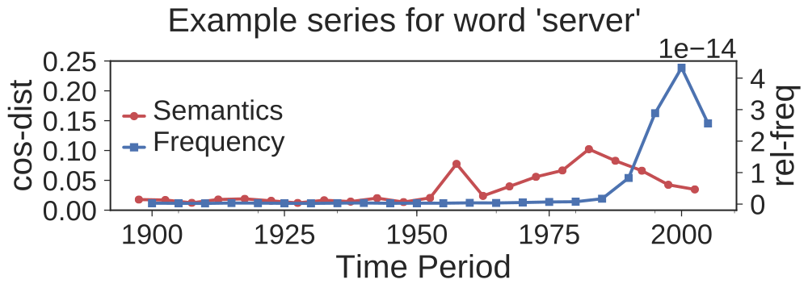

# SCAF - Semantic Change Analysis with Frequency
[](https://travis-ci.com/englhardt/scaf)

<p align="center">
  
</p>

This repository contains code for semantic change analysis of words that combines word embeddings with word frequencies.
For results on a synthetic corpus, the [Google Books Ngram Corpus](https://storage.googleapis.com/books/ngrams/books/datasetsv2.html) and on [Twitter data](https://archive.org/details/twitterstream) see

> Adrian Englhardt, Jens Willkomm, Martin Schäler and Klemens Böhm, "Improving Semantic Change Analysis by Combining Word Embeddings and Word Frequencies", International Journal on Digital Libraries (IJDL), 19 Mar 2019.

For a download of the generated word embeddings and results, see the [companion website](https://dbis.ipd.kit.edu/2601.php)

The code is licensed under a [MIT License](https://github.com/englhardt/scaf/blob/master/LICENSE) and the data set under a [Creative Commons Attribution 4.0 International License](https://creativecommons.org/licenses/by/4.0/).
If you use this code or data set in your scientific work, please reference the companion paper.

## Installing
To install the package run the following steps:
```
pip install -r requirements.txt
python setup.py install
```

Run `python setup.py test` to run the tests or `tox` to run test for all supported python versions (2.7, 3.5 and 3.6).

## Overview

This repository contains the following elements to perform semantic change analysis:

* Training word embeddings: Given a configuration file, [scaf/jobs/training.py](scaf/jobs/training.py) trains a word embedding model from a corpus in the [Google Books Ngram format](https://storage.googleapis.com/books/ngrams/books/datasetsv2.html).
* Evaluating word embeddings: Test a word embedding model with word sense and analogy tests ([scaf/jobs/embedding_evaluation.py](scaf/jobs/embedding_evaluation.py)).
* Build time series: Combine word embedding similarities with word frequencies to a two-dimensional time series ([scaf/jobs/build_timeseries.py](scaf/jobs/build_timeseries.py)).
* Change detection: Given a configruation file, [scaf/jobs/change_detection.py](scaf/jobs/change_detection.py) runs the change detection for the synthetic corpora.

For a full example from training word embeddings up to the change detection see the example notebook in [example/example.ipynb](example/example.ipynb).

## Author
For questions and comments, please contact [Adrian Englhardt](https://github.com/englhardt).
